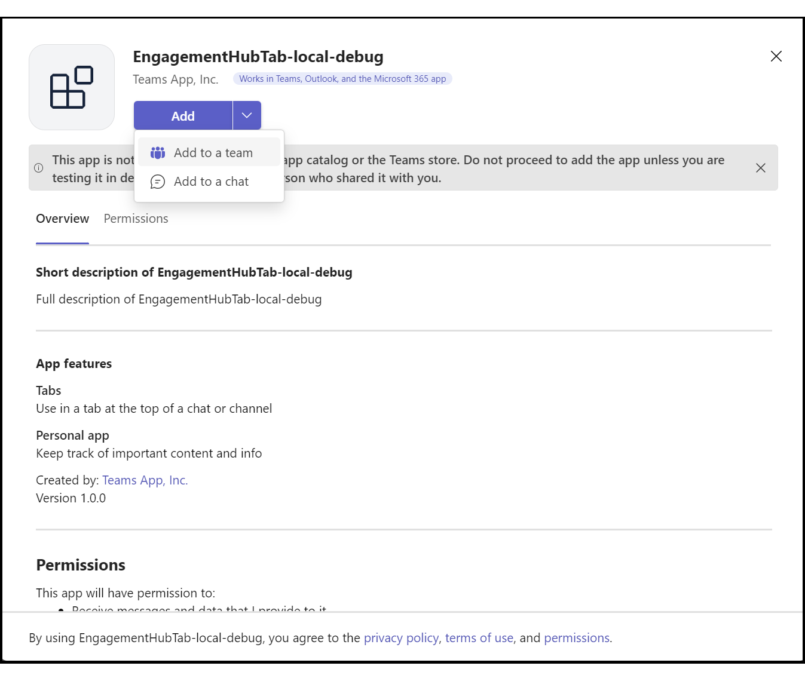

# Teams Engagement Hub for Power Virtual Agents

This reference application shows how to implement a Microsoft Teams 
engagement hub for Power Virtual Agents. This allows PVA chatbots to
escalate to human agents in Teams when needed.  To see this in action, you
can [watch this short demo](http://bit.ly/thubdemo) that should give you a
good sense of what this solution is all about.  You can use this solution to
explore how to build your own custom engagement hub or use it as a starting
baseline for a Team's backed engagement hub for scenarios like IT Help Desk or
customer support.

Something that's important to understand about this reference application is
that although it uses Teams as the agent portal, this solution does not
require users to be Teams users even when deployed as public facing site
hosting ordinary Internet users.

**Important Note** - This is a reference application, not a production ready
application and you will need to look it over to make sure you add the type
of controls and security your production application requires. For example,
the Azure Function API are fully open and would need to be secured.  Keys for
the services would need to be properly stored and accessed, etc., etc.


Here's how the solution works:

1) User browses to SampleApp which hosts a **ReactWebChat** control that
connects to your PVA Chatbot which allows a user and your chatbot to
have a conversation. However, at somepoint in the conversation, the PVA chatbot
could decide that agent escalation is warranted, or the user could enter
one of the agent escalations trigger phrases which then leads to step 2
2) One way or the other, your **Escalate** Topic will be triggered and
its flow would contain a standard **Transfer to Agent** node which causes
the standard ```handoff.initiate``` to be sent back to the **ReactWebChat**
control
3) Escalation middleware that the **ReactWebChat** was initialized with listens
for the ```handoff.initiate`` event and calls the EscalateToAgent() API in the
EngagementHub Azure Function project
4) The EscalateToAgent() API does the following: **A)** adds an escalation
record to the **Escalation** table in the Azure Storage resource **B)** creates
a new ACS message thread that will be used to connect user and agent and **C)** 
returns the conversation ID of the ACS message thread to the SampleApp which
uses it to create a **MessageThread** component from the ACS UI Library and
displays it in an Agent tab that now becomes visible in the SampleApp
5) The EngagementHubTab application has a background polling loop that
checks for new escalations and displays any it finds to all agents.  
**Note** - I initially implemented an
[Azure Web PubSub](https://learn.microsoft.com/en-us/azure/azure-web-pubsub/overview)
approach instead of polling, but there were runtime faults when running as a
Teams Tab app so I had to go "plan B" and poll until I can figure out what is 
happening with the Azure Web PubSub implementation when in a Teams context
6) Agent clicks the green "accept" button on an escalation request and the
**EngagementHubTab** app calls the AcceptChatRequest() API which then adds the
agent to the ACS message thread that was created earlier and the escalated
conversation is now connected and user and agent can begin chatting

## Getting Started
**Prerequisites** - I used both Visual Studio and Visual Studio Code to build
this solution. You will need to install the Teams Toolkit Extension is VS Code.

1. Clone this repo

2. Opens Teams and click the **Join or create team** button at the bottom of
the Teams list and then click the **Create Team** button in content area.
This will bring up a list of templates you can use to create the Team that
you'll later use to add the Agent Console (i.e. the EngagementHubTab
app). For example, there is an **Organize Help Desk** template that's great
for an IT Help Desk scenario and later, you'll add the Agent Console to it.  
  
**Note:** Creating a Team is optional and, alternatively, you could add the Agent
Console as a personal tab if you would prefer.  Also, if you have more than one
helpdesk you need to support, for example, one for HR, another for Finance and
a third for a Time Reporting application then you could create a Team for
each and add the Agent Console tab to each of those and have a nice way to
organize support information and collaborate for each of those.

3. Create a PVA bot and save the bot ID to something like notepad for use later.
You can find the bot ID by going **Settings | Channels | Mobile app** and then
select what you see in the blue highlighted section of this diagram. Be careful
to copy the string after the "_" and before the "/" characters since neither of
those characters are part of the bot ID.  
  
**Note:** The **Bot app ID** on the **Settings | Details** page is not the same
thing as the bot ID from **Mobile app** channel so make sure you get the bot ID
from **Mobile app** channel  


4. Next change its Escalate Topic to look like the following:  
  
**Note:** The body of the **Transfer to Agent** node is application specific
and can be anything you need it to be.  The example in this solution has
hardcoded values but in a real application they would be variables that held
the appropriate data.  The EscalationMiddleware() listener in 
**\TeamsEngagementHub\SampleApp\app\src\components\ChatBot.tsx** looks for
escalations and that's were you would extract this payload and process it.
```
{
  "skill": "skill-name",
  "customerName": "Elmo Baggins",
  "phone": "443 555-1212",
  "customerType": "Gold Card",
  "whyTheyNeedHelp": "Order not received"
}
```

5. Create a **Communication Services** resource in Azure and copy the connection
string in the **Keys** blade to something like notepad for use later  
 

6. Create an **Storage Account** in Azure and copy the connection string in
the **Access keys** blade to something like notepad for use later  


7. Configure **\TeamsEngagementHub\SampleApp\app\src\settings\appsettings.ts**
and set **botid** to the value you saved in step 3 and save the file.  
```/**
 * App settings for the Engagement Hub
 */
 export const appsettings = {
    engagementHubBaseAddress: 'http://localhost:7150',
    botId:'<your bot ID goes here>'
};
```

8. In the **\TeamsEngagementHub\EngagementHub** folder, create a local config
file named **local.settings.json** and paste in the following content:
```
{
  "IsEncrypted": false,
  "Values": {
    "AzureWebJobsStorage": "UseDevelopmentStorage=true",
    "FUNCTIONS_WORKER_RUNTIME": "dotnet",
    "agentHubStorageConnectionString": "<your storage connection string>",
    "acsConnectionString": "<your ACS connection string>",
    "botBaseAddress": "http://localhost:7150/",
    "useACSManagedIdentity": "false"
  },
    "Host": {
    "CORS": "*"
  }
}
```
9. Set the **acsConnectionString** setting to the connection string from ACS
resource you created in step 5.

10. Set the **agentHubStorageConnectionString** setting to the connection string
from the storage resource you created in step 6 and save the file.

11. Open **\TeamsEngagementHub\EngagementHub\EngagementHub.csproj** in Visual Studio
and start the debugger (F5).  This will run the backend APIs locally and the
config files have been hardcoded to point to this running instance of the APIs

12. Open a Terminal in the **\TeamsEngagementHub\SampleApp\app** folder and install
the packages by running this command:  
```npm install```

13. Now launch SampleApp locally in the browser by running this command:  
```npm start```

14. Open a separate Terminal in the **\TeamsEngagementHub\EngagementHubTab\tabs**
folder and install the packages by running this command:  
```npm install``` 

15. Open the **\TeamsEngagementHub\EngagementHubTab** folder in **Visual Studio Code**
and then launch the debugger (F5).  This will trigger the Teams Toolkit extension
to deploy the Teams Tab app.  Click the **Add to a team** from the **Add** button
dropdown.  
  
Next, choose the **Team** you want to add the Agent Console tab to, which in
this case, is the one you created in step 2 and then click **Step up tab** button.  
  
Finally, when the **Tab Configuration** dialog comes up, just click **Save**  
&nbsp;  
**Note:** You can add the Agent Console Tab to as many channels as you like and 
each agent will have a separate instance and they will only see the escalations
they've take ownership of plus the escalations that haven't been assigned to an
agent yet  
&nbsp;  
**Pro Tip:** Every time you launch the debugger the Teams Toolkit extension will
try to deploy the Teams Tab app but this only needs to be done once so you can
just close the dialog to skip past that step and then navigate to the Agent
Console

16. In the browser where the Sample App is running, click the bot icon in the
lower right-hand corner to popup the chat window and type "talk to agent" to
trigger an agent escalation which should bring up a new Agent tab and you'll be
asked to wait for an agent to accept you escalation request.

17. In the browser where the Agent Console is running, you'll see your escalation
request pop into the escalation list and you can then click the green answer
button which launches a new chat window where the user and agent can now chat back
and forth until the agent ends the conversation by clicking the red hangup button.
